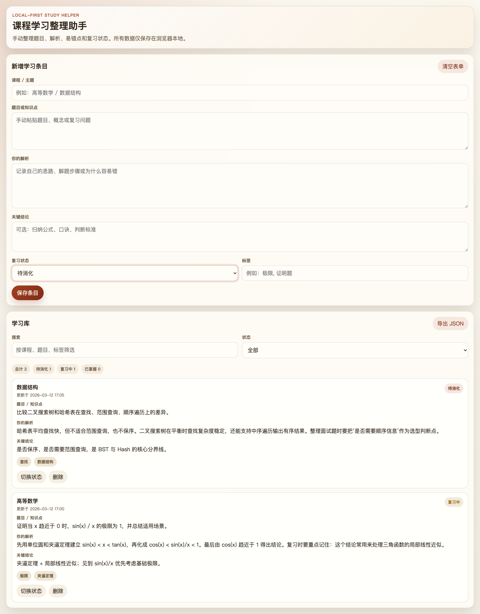

# 课程学习整理助手

一个本地优先的 Chrome 扩展，用来整理课程题目、记录自己的解析、标记复习状态，并沉淀错题与知识点笔记。

当前版本不做任何网页注入、自动答题、远程答案抓取或考试辅助。它只提供一个本地学习库，帮助学生把题目和自己的理解整理成可复习的资料。



## 为什么重构

这个仓库在早期阶段包含过不合适的答题辅助实现。现在的目标已经明确调整为合规的学习辅助工具：

- 手动录入题目或知识点
- 记录自己的解析和关键结论
- 维护待消化 / 复习中 / 已掌握三种状态
- 用标签组织错题、章节和专题
- 本地导出 JSON，方便迁移和备份

## 功能

- 本地学习条目管理
- 课程 / 题目 / 解析 / 关键结论录入
- 标签分类与关键词搜索
- 复习状态切换
- 本地 JSON 导出

## 合规边界

本项目明确不支持以下行为：

- 自动获取课程平台答案
- 自动填答、代答或考试过程辅助
- 向第三方题库或远程接口发送题目以换取答案
- 对在线教学或考试页面进行注入式干预

如果后续贡献偏离这些边界，应该被拒绝合并。

## 目录

```text
study-helper-extension/
  manifest.json
  popup.html
  popup.css
  popup.js
```

## 安装

1. 打开 Chrome 或 Edge。
2. 进入 `chrome://extensions/`。
3. 打开“开发者模式”。
4. 点击“加载已解压的扩展程序”。
5. 选择仓库里的 `study-helper-extension` 目录。

## 使用方式

1. 点击扩展图标打开面板。
2. 手动粘贴题目或知识点。
3. 写下自己的解析、关键结论和标签。
4. 通过状态管理复习进度。
5. 需要备份时导出 JSON。

## 维护方向

- 增加导入功能
- 增加按课程分组
- 增加复习提醒和间隔复习视图
- 增加无障碍和国际化支持

详细规划见 [ROADMAP.md](ROADMAP.md)。

## License

Apache-2.0
